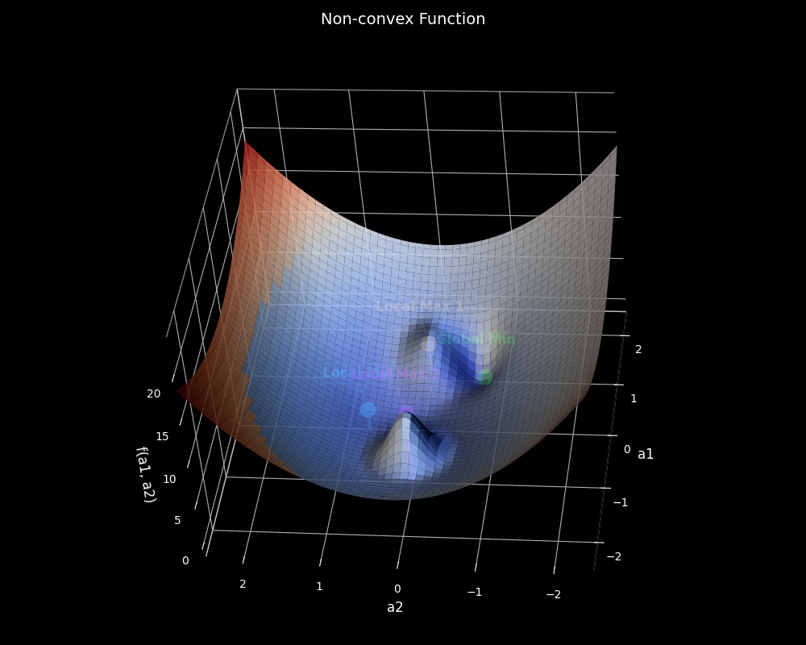
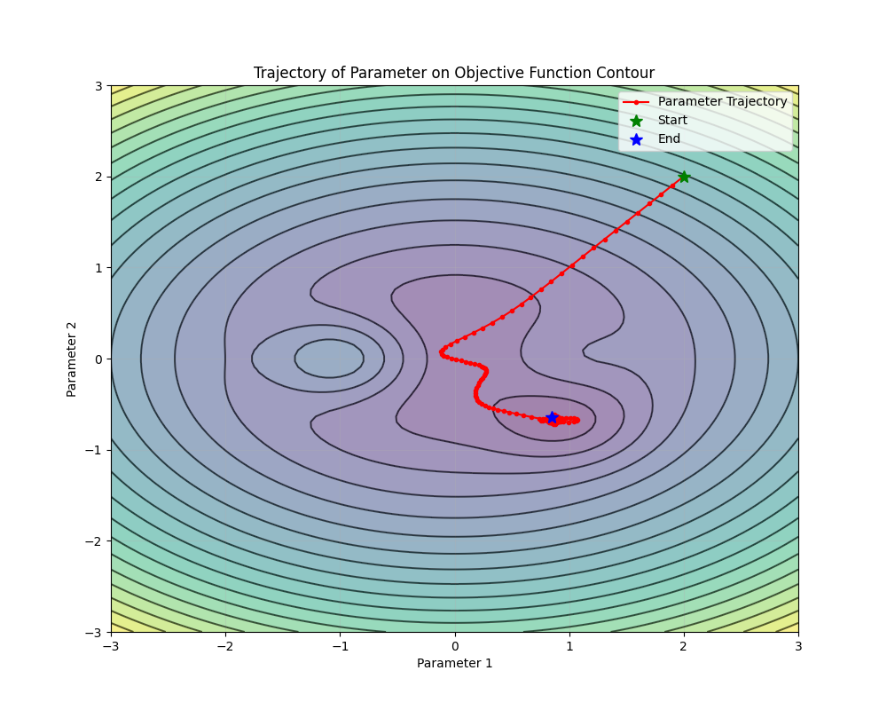
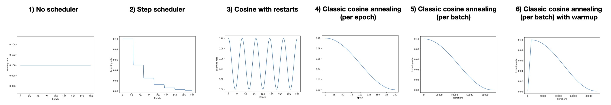

# Homework 6: Optimization

The due date is April 3 at midnight. Please follow the [code squad rules](https://junwei-lu.github.io/bst236/chapter_syllabus/syllabus/#code-squad). If you are using the late days, please note in the head of README.md that "We used XX late days this time, and we have XX days remaining". 

The main purpose of this homework is to help you:

- Implement optimization algorithms in PyTorch
- Explore how the learning rate and optimization algorithm affect the performance of model training
- Build up your reproducible workflow for model training
- Build up your workflow for hyperparameter tuning
- Learn how to use SLURM for cluster job submission
- Learn how to inherit parent class and override methods for customizing the behavior of the model.

The repository basically has the same code structure as the template we showed in the class. You will experience how to modify the existing code for customizing your own model. This is a very important skill for your future research and work.


In this homework, you need to fill in the missing code under `#TODO` in the python files in the `src` folder.  We will give specific instructions for each part. 

## Problem 1: Lasso Regression


We have learned many algorithms in class. We are going to compare their performance on Lasso:

$$\hat \beta = \arg\min_{\beta \in \mathbb{R}^d} \frac{1}{n}||Y-X\beta||_2^2 + \lambda ||\beta||_1.$$

We have provided most of the infrastructure code for you. Please first understand (with the help of copilot) the code infrastructure:

- `SparseLinearRegressionDataset` in `src/dataset.py` defines the dataset for high-dimensional sparse linear regression
- `LinearRegressionModel` in `src/model.py` defines the linear regression model
- `Trainer` in `src/train.py` defines the training loop
- `src/utils.py` defines utility functions.
- `src/config_Lasso.py` defines the configuration for the hyperparameters.
- `src/main_Lasso.py` is the main file to run the training.
  
**1.1** (**Setup the dataset**) Generate the dataset by defining `SparseLinearRegressionDataset` class in `src/dataset.py`.
So that when you call
```python
train_dataset = SparseLinearRegressionDataset(
            num_samples=num_samples,
            input_dim=input_dim,
            sparsity=sparsity,
            noise_std = noise_std
        )
```

It will generate the following synthetic data for high-dimensional sparse linear regression with $d=$`input_dim`, $n=$`num_samples`, $s=$`sparsity`, $\sigma=$`noise_std`.

$Y = Xw + \varepsilon$, where

$X \in \mathbb{R}^{n\times d}$ with entries $X_{ij} \sim \mathcal{N}(0,1)$ i.i.d.

$w \in \mathbb{R}^d$ is a sparse vector where:
  - $w_j = 1$ for $j \leq \lfloor d\times s\rfloor$
  - $w_j = 0$ for $j > \lfloor d\times s\rfloor$
  
$\varepsilon \sim \mathcal{N}(0, \sigma^2I_n)$

**1.2** (**Set up the loss function**) Define the loss function of Lasso regression

$$\frac{1}{n}||y-\hat y||_2^2 + \lambda||w||_1.$$

in `mse_with_l1_reg` function in `src/main_Lasso.py`.

Once you have finished all the `#TODO`s, you should be able to run the following command to train the model if `OPTIMIZER == 'SGD'` in `src/config_Lasso.py`.

```bash
python3 src/main_Lasso.py
```

**1.3** (**Define a new optimizer**) Finish the [FISTA optimizer](https://junwei-lu.github.io/bst236/chapter_optimization/proximal_gradient_descent/#accelerated-proximal-gradient-descent) in `src/train.py` following the instructions and hints inside the class.  We have provided the template for you and ask to you to:

- Read the `ISTA` class and understand how you define a new optimizer by inheriting the `Optimizer` class in `torch.optim.optimizer`. Then you can use the training template in `src/train.py` to train your optimizer.
- Read the comments in the `FISTA` class and understand the data structure of `self.param_groups` and `self.state`. How the auxiliary variables of FISTA are stored in these two dictionaries?
- In `step()` of `FISTA` class, there are five `#TODO`s you need to fill in. We have provided the hints inside the class to remind you of potential pitfalls, especially the [in-place operations](https://junwei-lu.github.io/bst236/chapter_optimization/pytorch_basics/#gradient-update).

Once you have finished all the `#TODO`s, you should be able to run the following command to train the model if `OPTIMIZER == 'FISTA'` in `src/config_Lasso.py`.

```bash
python3 src/main_Lasso.py
```
  

**1.4** (**Tuning the hyperparameters**) Find the best learning rate among `[0.0001, 0.001, 0.01, 0.1]` to minimize the validation MSE loss for the following algorithms:

1. [Gradient descent](https://junwei-lu.github.io/bst236/chapter_optimization/gradient_descent/): directly compute the gradient of l1-penalized loss
2. [ISTA](https://junwei-lu.github.io/bst236/chapter_optimization/proximal_gradient_descent/#example-lasso)
3. [FISTA](https://junwei-lu.github.io/bst236/chapter_optimization/proximal_gradient_descent/#accelerated-proximal-gradient-descent)
4. [Mini-batch Stochastic Gradient Descent](https://junwei-lu.github.io/bst236/chapter_optimization/sgd/#mini-batch-gradient-descent)
5. [Adam](https://junwei-lu.github.io/bst236/chapter_optimization/sgd/#adam)

You only need to do the following to complete this task:

- Understand how the `parser` in `src/main_Lasso.py` to parse the command line arguments such that you can run `python src/main_Lasso.py --learning_rate 0.0001 --optimizer ISTA` to manually set the learning rate and optimizer. Fix all other hyperparameters as the default values in `src/config_Lasso.py`
- Finish the `#TODO` in `src/main_Lasso.py` to overwrite the learning rate and optimizer if command line arguments are provided.
- Read the `slurm_jobs/submit_all_lasso.sh` and `slurm_jobs/run_single_lasso_job.sh` to understand how to submit multiple jobs parallelly for different learning rates and optimizers in the class cluster.
- Submit all the jobs with different learning rates and optimizers by running in the cluster terminal:

```bash
./slurm_jobs/submit_all_lasso.sh
```

- The training logs and results will be saved in `LOGS_DIR` and `RESULTS_DIR` in `src/config_Lasso.py`. You can find the best learning rate by using `experiment_summary.ipynb`. (For this problem, the best learning rate should give fastest convergence.) Pay attention you need to change the line `log_dir = 'output/logs'` to `log_dir = 'lasso_output/logs'` in the `experiment_summary.ipynb` to properly process the results.


**1.5** (**Summarize the numerical experiments**) Compare the performance of the above algorithms with the best learning rate using `experiment_summary.ipynb`. Report your results and explain your observations in `Readme.md#Report`. Summarize the pros and cons for the current workflow for hyperparameter tuning and different method comparison and how you could improve the workflow template for your future model training.

## Problem 2: Non-convex Optimization

We aim to find the minimizer of the following 2d function:

$$
f(a_1, a_2) =
2 e^{-\frac{(a_1 - 1)^2 + (1.4a_2)^2}{0.2}} +
6 e^{-\frac{(a_1 + 1)^2 + (1.4a_2)^2}{0.2}} -
3 e^{-\frac{(a_1 - 1)^2 + (1.4a_2 + 1)^2}{0.2}} -
0.2 e^{-\frac{(a_1)^2 + (1.4a_2 -1)^2}{0.2}} +
a_1^2 + (1.4a_2)^2
$$

It has the global minimum around $(1, -1/1.4)$ as long as the local minima around $(0, 0)$ and two local maxima around $(1, 0)$ and $(-1, 0)$.  You can use `surface_viz.py` to visualize the function. 




We have provided the following infrastructure code for you:
- `nonconvex_objective` in `src/model.py` defines the non-convex objective function $f(a_1, a_2)$
- `NonConvexModel` in `src/model.py` defines the 2d parameter $(a_1,a_2)$ as `self.a`
- We define a new class `NonconvexTrainer` in `src/main_nonconvex.py` that inherits the `Trainer` class and override some methods for the new problem. You need to complete the missing code in the class to practice the **Objective Oriented Programming** paradigm.
- `src/config_nonconvex.py` defines the configuration for the hyperparameters.
- `src/main_nonconvex.py` is the main file to run the training.

**2.1** (**Set up a new trainer**) We want you to practice how to modify the code from Problem 1 to solve this new problem by using the **Objective Oriented Programming** paradigm. As Problem 2 is not a regression problem, the current `Trainer` class is not suitable for this problem. The best practice is that you should not change any old code but write a new trainer class `NonConvexTrainer` that inherits the `Trainer` class and override some methods for the new problem. So you only need to overwrite these functions you need to change and inherit the rest of the functions from the parent class. This will be good practice for minimizing working load, potential mistakes and enhancing the  code robustness and reusability which can not be easily done by R.

When inheriting from a parent class, we can use `super()` to access the parent class's methods and attributes. This allows us to:

1. Call the parent class's constructor using `super().__init__(*args, **kwargs)`
2. Reuse parent class methods by calling `super().method_name()`
3. Override only the methods that need customization while inheriting the rest

In specific, in this subproblem, you need to complete all the `#TODO`s in the `NonconvexTrainer` class:
 
- Override `_evaluate_model()` and `_train_epoch()` with custom logic. Fill in the `#TODO` in `_evaluate_model()` to evaluate the nonconvex objective directly without using validation data. 
- Fill in the `#TODO`s in `_train_epoch()` to update the model parameters using the optimizer.
- Fill in the `#TODO`s in `train()` to call the parent's `train()` and adding `plot_parameter_trajectory_on_contour`defined in `utils.py` which will illustrate the trajectory of the parameter on the contour plot like the plot below. 



Once you have finished all the `#TODO`s, you should be able to run the following command to train the model:

```bash
python3 src/main_nonconvex.py
```

Check the plots in `nonconvex_output/results/` to see the training results.

**2.2** (**Explore the dynamics of different optimizers**) Find the best learning rate among `[0.0001, 0.001, 0.01, 0.1]` to minimize nonconvex objective using the following algorithms:

1. [Gradient descent](https://junwei-lu.github.io/bst236/chapter_optimization/gradient_descent/)
2. [Stochastic Gradient Descent](https://junwei-lu.github.io/bst236/chapter_optimization/sgd/#mini-batch-gradient-descent)
3. [RMSProp](https://junwei-lu.github.io/bst236/chapter_optimization/sgd/#rmsprop)
4. [Adam](https://junwei-lu.github.io/bst236/chapter_optimization/sgd/#adam)

**Note:** For deterministic loss, the stochastic gradient algorithms (SGD, RMSProp, Adam) uses the random gradient $g_t = \nabla f(a_t) + \zeta_t$ where $\zeta_t \sim \mathcal{N}(0, 1/\text{BatchSize})$ is a random noise.  Please check the following code in `src/main_nonconvex.py` to see how we implement this:

```python
if self.hyperparams['OPTIMIZER'] != 'GD':
    # Here for stochastic optimizers, we want to add noise zeta ~ N(0, 1/sqrt(batch_size)) to the gradient
    # Instead of rewrite the optimizer, we can revise the loss function f(a) -> f(a) + zeta * sum(a) 
    # then the gradient will be grad(f(a)) + zeta
    zeta = torch.randn((), device=self.device) / (self.hyperparams['BATCH_SIZE'] ** 0.5)
    current_loss += torch.sum(self.model.a) * zeta
```


You only need to do the following to complete this task:

- Understand how the `parser` in `src/main_Lasso.py` to parse the command line arguments such that you can run `python src/main_Lasso.py --learning_rate 0.0001 --optimizer ISTA` to manually set the learning rate and optimizer. Fix all other hyperparameters as the default values in `src/config_Lasso.py`
- Mimicing the parser in `src/main_Lasso.py`, finish the `#TODO` in `src/main_nonconvex.py` to parse the command line arguments and overwrite the learning rate and optimizer if command line arguments are provided.
- Mimicing the shell scripts in `slurm_jobs` for Problem 1, write new shell scripts to submit multiple jobs for nonconvex optimization parallelly for different learning rates and optimizers in the class cluster.


- The training logs and results will be saved in `LOGS_DIR` and `RESULTS_DIR` in `src/config_nonconvex.py`. You can find the best learning rate by using `experiment_summary.ipynb`. Pay attention you need to change the line `log_dir = 'output/logs'` to `log_dir = 'nonconvex_output/logs'` in the `experiment_summary.ipynb` to properly process the results.

Use the loss curves and trajectory plots in `nonconvex_output/results/` to compare the performance of the above algorithms with the different learning rates. Report your results and explain your observations in `Readme.md#Report`, especially how different optimizers may trap into local minima with different learning rates.


**2.3** (**Set up a dynamic learning rate by scheduler**) You can change your learning rate in PyTorch by using the `scheduler`s. PyTorch schedulers allow you to dynamically adjust the learning rate during training. You can create a scheduler by passing your optimizer to it, like `scheduler = optim.lr_scheduler.StepLR(optimizer, step_size=10, gamma=0.5)`. Then call `scheduler.step()` after each epoch to update the learning rate according to the scheduler's policy. We have implemented all the scheduler code for you. Please check in `src/main_nonconvex.py` to see how we use the schedulers.



In this subproblem, you need to:

- Read the documents of PyTorch schedulers for [StepLR](https://pytorch.org/docs/stable/generated/torch.optim.lr_scheduler.StepLR.html) and [CosineAnnealingWarmRestarts](https://pytorch.org/docs/stable/generated/torch.optim.lr_scheduler.CosineAnnealingWarmRestarts.html). Briefly explain in `Readme.md#Report` how these two schedulers may potentially improve the performance of the optimization. 

- Implement both the StepLR and CosineAnnealingWarmRestarts schedulers for the above algorithms for nonconvex optimization. We have implemented all the code for you. You only need to change the `SCHEDULER` in `src/config_nonconvex.py` and run `python src/main_nonconvex.py` to train the model. You can choose the other hyperparameters by yourself. Report your results and compare the performance of the two schedulers with constant learning rate in `Readme.md#Report`. Though not required, you are encouraged explore how the parameters of the schedulers in the following code in `src/main_nonconvex.py`:

```python
    scheduler = None
    if hyperparams['SCHEDULER'] == "StepLR":
        scheduler = optim.lr_scheduler.StepLR(optimizer, step_size=10, gamma=0.5)
    elif hyperparams['SCHEDULER'] == "CosineAnnealingWarmRestarts":
        scheduler = optim.lr_scheduler.CosineAnnealingWarmRestarts(optimizer, T_0=NUM_EPOCHS//10)
```

may potentially impact the performance of the optimization.


